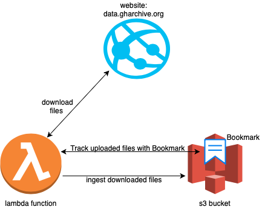

# gharchive-data-ingestion
[](https://github.com/prabhuwk/gharchive-data-ingestion/actions/workflows/main.yml)



# Installation
## For development
```bash
$ python3.10 -m venv venv
$ source venv/bin/activate
$ pip3.10 install --upgrade pip
$ pip3.10 install -r requirements_dev.txt
```

## For lambda deployment
```bash
$ pip3.10 install --upgrade pip
$ pip3.10 install -r requirements.txt -t lambda_lib
```

### Create zip file
```bash
$ cd lambda_lib
# creating new zip file
$ zip -r ../gharchive_data_ingestion.zip .
# adding additional file to existing zip file
$ cd ../src/
$ zip -g ../gharchive_data_ingestion.zip *.py
```
